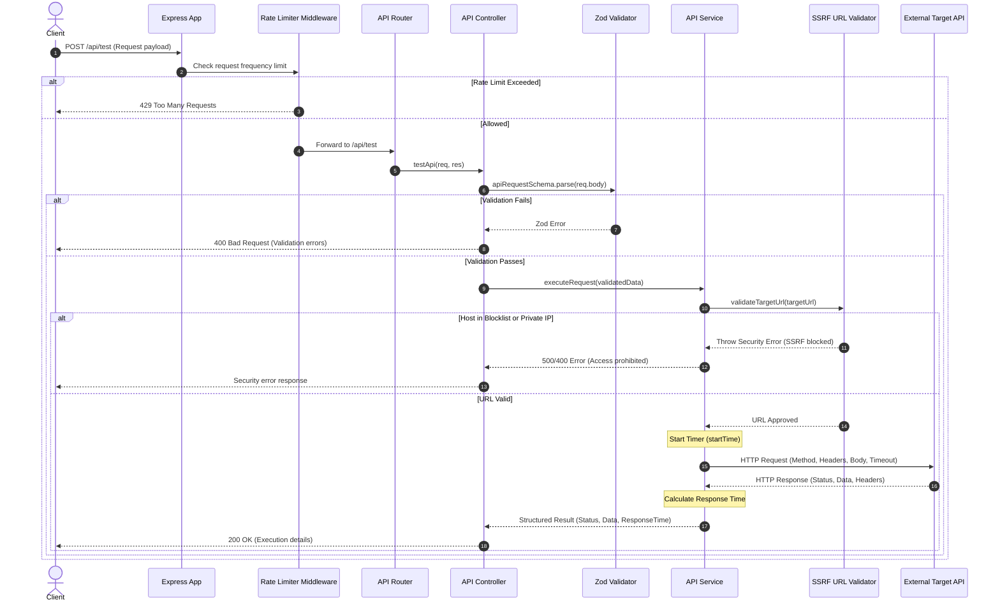

# APIForge - API Testing Platform

APIForge is a lightweight, secure API testing engine built with Node.js and Express. It enables developers to proxy, execute, and profile HTTP API requests safely with built-in SSRF protection, input validation, rate limiting, and response time metrics.

---

## 🔄 Request Execution Sequence Diagram

The following diagram illustrates the complete end-to-end request pipeline for executing an API test via `POST /api/test`:



---

## ✨ Features

- 🛡️ **SSRF & Protocol Protection**: Strict protocol enforcement allowing only `http:` and `https:`. Blocks non-standard/risky schemes (`file:`, `ftp:`, `gopher:`, `javascript:`, etc.) as well as internal/private IPv4 networks (`10.x.x.x`, `172.16-31.x.x`, `192.168.x.x`), cloud metadata services (`169.254.169.254`), and loopback addresses (`localhost`, `127.0.0.1`).
- ⚡ **Rate Limiting**: Protects endpoints from abuse using `express-rate-limit`.
- ⏱️ **Response Time Profiling**: Measures request latency in milliseconds (`responseTime`).
- 📋 **Schema Validation**: Robust payload validation using `zod`.
- 🩺 **Health Monitoring**: Dedicated health check endpoint at `/api/health`.
- 🌐 **CORS & Security Headers**: Integrated with `cors` and `helmet`.

---

## 🛠️ Project Structure

```
API testing platform/
├── src/
│   ├── controllers/
│   │   └── api.controller.js     # Request orchestration & response handling
│   ├── middlewares/
│   │   └── rateLimiter.js        # Express rate limiter configuration
│   ├── routes/
│   │   └── api.routes.js         # API route definitions
│   ├── services/
│   │   └── api.service.js        # Axios HTTP execution engine
│   ├── utils/
│   │   └── urlValidator.js       # SSRF & IP range validation logic
│   ├── validators/
│   │   └── api.validator.js      # Zod schema definitions
│   ├── app.js                    # Express application setup
│   └── server.js                 # HTTP server listener entrypoint
├── .env                          # Environment variables configuration
├── .gitignore
├── package.json
└── README.md
```

---

## 🚀 Getting Started

### Prerequisites

- **Node.js**: v18.0.0 or higher
- **npm**: v9.0.0 or higher

### Installation

1. **Clone the repository and install dependencies:**

   ```bash
   npm install
   ```

2. **Configure Environment Variables:**
   Create a `.env` file in the project root if needed:

   ```env
   PORT=3000
   ```

3. **Start the Development Server:**
   ```bash
   npm run dev
   ```
   The server will start at `http://localhost:3000`.

### 2. Execute API Test

Proxies an HTTP request to a target external API and returns execution metrics.

- **URL:** `/api/test`
- **Method:** `POST`
- **Headers:** `Content-Type: application/json`

#### Request Body Schema (`Zod`)

| Field     | Type     | Required | Description                                           |
| :-------- | :------- | :------- | :---------------------------------------------------- |
| `method`  | `string` | **Yes**  | HTTP method (`GET`, `POST`, `PUT`, `PATCH`, `DELETE`) |
| `url`     | `string` | **Yes**  | Target API URL (Must be a valid HTTP/HTTPS URL)       |
| `headers` | `object` | No       | Key-value pairs for request headers                   |
| `query`   | `object` | No       | Key-value pairs for URL query parameters              |
| `body`    | `any`    | No       | Request body payload                                  |
| `timeout` | `number` | No       | Timeout in milliseconds (Range: 1000 - 10000)         |

#### Example Request

```json
{
  "method": "POST",
  "url": "https://jsonplaceholder.typicode.com/posts",
  "headers": {
    "Content-Type": "application/json"
  },
  "body": {
    "title": "foo",
    "body": "bar",
    "userId": 1
  },
  "timeout": 5000
}
```

#### Example Success Response (`201 Created`)

```json
{
  "success": true,
  "status": 201,
  "responseTime": 245,
  "responseSizeBytes": 108,
  "responseSize": "108 Bytes",
  "headers": {
    "content-type": "application/json; charset=utf-8"
  },
  "data": {
    "id": 101,
    "title": "foo",
    "body": "bar",
    "userId": 1
  }
}
```
